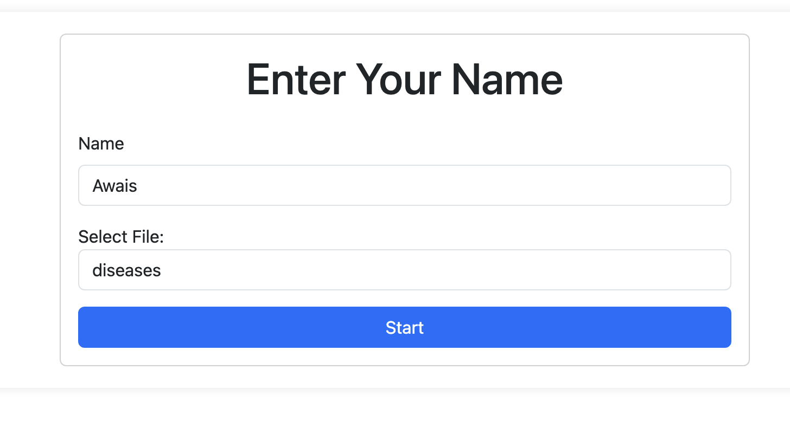
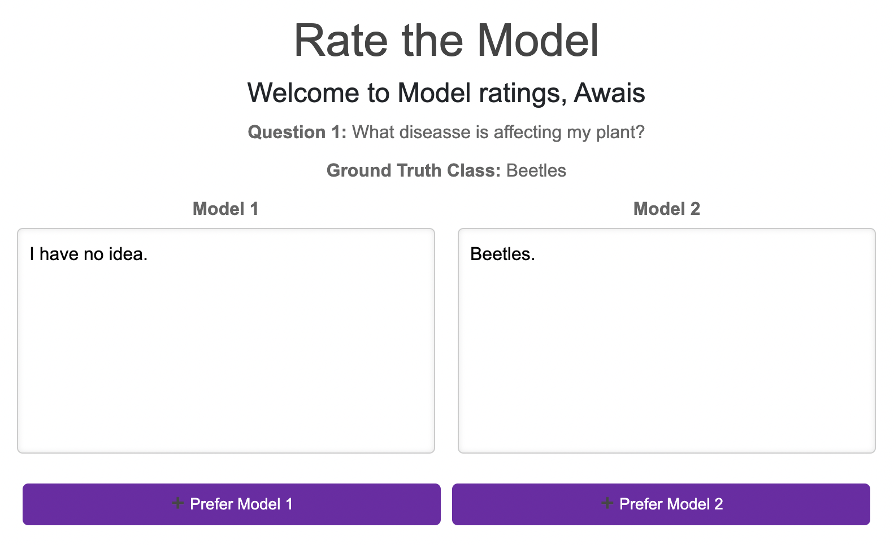

# README

A simple Flask web interface that lets users rate answers to questions using two different models and save ratings in a CSV file.

## Run

Add question files in the questions folder with names in the file options on the `name.html`

```bash
<option_name>_questions.csv
```

and format

```csv
question_id,question_text,model1,model2
```

Install environment and packages.

```bash
conda create -n "evals" python=3.8
conda activate evals
pip install -r requirements.txt
```

Run the app

```bash
python app.py
```

## Usage

Read and rate the answers, and the output will saved in the ratings folder.

## Demo


